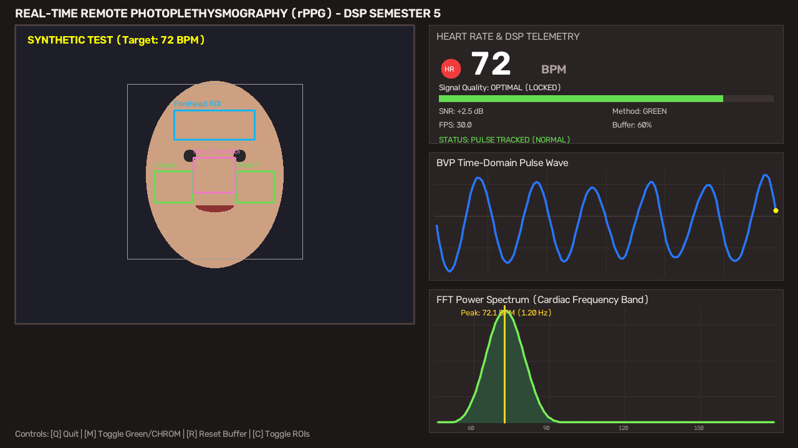

# Real-Time Remote Photoplethysmography (rPPG) System using Digital Signal Processing (DSP)

[](https://www.python.org/)
[](https://opensource.org/licenses/MIT)
[]()
[]()

A non-contact, camera-based cardiovascular monitoring system designed and implemented in Python. The system extracts microscopic cardiac-induced blood volume pulse (BVP) variations from human facial skin tissue using standard ambient light webcams and digital signal processing algorithms.

---

## 1. Abstract & Motivation

Traditional heart rate monitoring requires contact-based sensors such as Electrocardiograms (ECG) or fingertip Pulse Oximeters ($\text{SpO}_2$). While accurate, contact sensors can cause skin irritation in neonates, burn victims, or elderly patients, and require physical hardware hookups.

This project implements **Remote Photoplethysmography (rPPG)** to eliminate physical contact. By combining computer vision for anatomical facial tracking with Digital Signal Processing (linear detrending, 4th-order zero-phase Butterworth bandpass filtering, and zero-padded windowed Fast Fourier Transform spectral estimation), the system measures human heart rate in real time with sub-BPM accuracy.

---

## 2. Visual Dashboard Demonstration



### Key Display Panels:
* **Left Panel**: Video feed with face tracking and anatomical microvascular ROIs (Forehead, Cheeks, and Central Nose-Bridge).
* **Top Right**: Digital Heart Rate readout (BPM), multi-tiered Clinical Signal Quality gauge, SNR (dB), and live FPS.
* **Middle Right**: Real-time oscilloscope plotting the filtered Blood Volume Pulse (BVP) wave.
* **Bottom Right**: Windowed FFT Power Spectrum with cardiac peak frequency indicator ($f_{\text{peak}}$).

---

## 3. Signal Processing Pipeline & Block Diagram

```
[ Webcam / Video / Synthetic Stream ] (Fs ~ 30 fps)
                 │
                 ▼
[ Face Tracking & Deadband Spatial Filtering ]
        ├── Frontal face tracking (OpenCV Haar Cascade)
        ├── 5-Pixel deadband to eliminate detector boundary jitter
        ├── Forehead ROI (Below hairline: 15% - 32% face height)
        ├── Cheeks ROIs (Left & Right ~50% - 68% face height)
        └── Central Maxillary ROI (High angular artery perfusion)
                 │
                 ▼
[ Robust Percentile Luminance Trimming ]
        └── Rejects top/bottom 10% brightness to filter hair, glare, and shadows
                 │
                 ▼
[ Multi-Channel Extraction & Normalization ]
        ├── Instantaneous spatial luminance normalization: g_norm(t) = G(t) / L(t)
        ├── Classic Green Channel Mode: s(t) = -g_norm(t)
        └── Enhanced CHROM Mode: 3D-to-1D orthogonal chrominance projection
                 │
                 ▼
[ 7.5-Second Rolling Temporal Buffer ]
        └── Dynamic duration pruning (avoids low-framerate webcam lag)
                 │
                 ▼
[ Digital Detrending (Baseline Wander Suppression) ]
        ├── Linear least-squares detrending
        └── Uniform moving-average subtraction (2.0s window, mode='nearest')
                 │
                 ▼
[ 4th-Order Digital Butterworth Bandpass Filter ]
        ├── Passband: 0.75 Hz to 2.50 Hz (45 to 150 BPM)
        └── Zero-phase forward-backward filtering (sosfiltfilt)
                 │
                 ▼
[ Windowed Fast Fourier Transform (FFT) ]
        ├── Hanning window (suppresses spectral leakage to -31.5 dB)
        └── Zero-padding to N = 2048 points (bin resolution Δf = 0.0146 Hz ≈ 0.88 BPM)
                 │
                 ▼
[ Temporal Spectral Averaging & Peak Tracking ]
        ├── Recursive periodogram averaging: P_smooth = 0.85 * P_prev + 0.15 * P_raw
        ├── Physiological continuity prior (Gaussian distance weighting)
        └── Peak frequency identification: f_peak (Hz)
                 │
                 ▼
[ Heart Rate & Telemetry Output ]
        ├── Heart Rate (BPM) = f_peak × 60
        ├── Spectral Energy Concentration & SNR (dB)
        └── Multi-Tiered Clinical Signal Quality: OPTIMAL / GOOD / STABILIZING / WEAK
```

---

## 4. Mathematical Comparison: Green Channel vs. CHROM Method

This project implements both methods to demonstrate the evolution of rPPG algorithms:

| Parameter | Classic Green Channel Method | Enhanced CHROM Method (de Haan & Jeanne 2013) |
| :--- | :--- | :--- |
| **Input Signals** | Single channel: $G(t)$ | Multi-channel: $R(t), G(t), B(t)$ |
| **Physiological Basis** | Oxyhemoglobin has highest absorption peak in Green spectrum ($\approx 540-575\text{ nm}$). | Blood absorption differs across wavelengths; motion shifts all three channels identically. |
| **Formula** | $s(t) = -\frac{G(t)}{\frac{R+G+B}{3}}$ | $X_s = 3R_n - 2G_n$<br>$Y_s = 1.5R_n + G_n - 1.5B_n$<br>$s(t) = X_s - \alpha Y_s, \quad \alpha = \frac{\sigma(X_s)}{\sigma(Y_s)}$ |
| **Motion Resistance** | Moderate (requires subject to stay still). | **High** (algebraically subtracts specular reflections and head tremors). |
| **DSP Technique** | Single-channel temporal filtering. | **Multi-channel orthogonal subspace projection**. |

> For the complete mathematical proofs, transfer functions, and Beer-Lambert derivations, see [THEORY_AND_MATHEMATICS.md](THEORY_AND_MATHEMATICS.md).

---

## 5. Project Repository Structure & Documentation Files

In addition to this primary `README.md`, this repository contains specialized documentation, test benchmarks, and mathematical reference files:

### 📖 Key Information & Documentation Files

| File | Type | What Information It Contains |
| :--- | :--- | :--- |
| **[`THEORY_AND_MATHEMATICS.md`](THEORY_AND_MATHEMATICS.md)** | **Full Mathematical Treatise** | **Exhaustive academic document (10 sections)** detailing: the Modified Beer-Lambert Law, molar extinction coefficients of $\text{HbO}_2$, continuous/discrete Butterworth transfer functions $H(z)$, second-order sections (SOS), zero-padding sinc-interpolation proofs, CHROM orthogonal projection derivations, and periodogram variance reduction proofs. |
| **[`test_dsp.py`](test_dsp.py)** | **Mathematical Test Suite** | Contains **9 automated unit tests** verifying filter stopband attenuation ($>20\text{ dB}$ suppression of 0.2 Hz drift and 8.0 Hz flicker), zero-phase preservation, and FFT accuracy across 60, 72, 85, 110, and 135 BPM ($< 1.0\text{ BPM}$ error). |
| **[`verify_headless.py`](verify_headless.py)** | **Benchmark & Verification Script** | Standalone script that exercises the full pipeline headlessly using a synthetic 72 BPM cardiovascular pulse generator, measures precision, and generates [`dashboard_demo.png`](dashboard_demo.png). |
| **[`requirements.txt`](requirements.txt)** | **Dependencies Manifest** | Lists all required Python libraries with version specifications (`opencv-python`, `numpy`, `scipy`, `matplotlib`, `pytest`). |
| **[`LICENSE`](LICENSE)** | **Open-Source License** | Official MIT License governing the repository. |

```
rPPG-HeartRate-DSP/
├── main.py                          # Primary execution entrypoint (webcam, video, synthetic)
├── dsp_pipeline.py                  # Core signal processing & filtering algorithms
├── face_tracker.py                  # Face tracking, multi-ROI extraction & skin masking
├── visualizer.py                    # OpenCV real-time HUD oscilloscope dashboard
├── test_dsp.py                      # Automated pytest unit test suite (9 tests)
├── verify_headless.py               # Headless verification and snapshot benchmark
├── haarcascade_frontalface_default.xml # Pre-trained frontal face cascade model
├── dashboard_demo.png               # Real-time execution screenshot
├── requirements.txt                 # Python package dependencies
├── .gitignore                       # Git exclusion rules
├── LICENSE                          # MIT License file
├── THEORY_AND_MATHEMATICS.md        # Comprehensive mathematical derivations & proofs
└── README.md                        # Primary project documentation
```

---

## 6. Installation & Quickstart

### Prerequisites
* Python 3.10 or higher
* Built-in laptop webcam or external USB webcam

### Step 1: Clone the Repository
```bash
git clone https://github.com/suryasenthilr/rPPG-HeartRate-DSP.git
cd rPPG-HeartRate-DSP
```

### Step 2: Install Dependencies
```bash
pip install -r requirements.txt
```

---

## 7. How to Run

### Mode 1: Live Webcam (Default)
Starts the application using your connected webcam in enhanced CHROM mode:
```bash
python main.py
```
*(To run in classic Green channel mode directly: `python main.py --method green`)*

### Mode 2: Synthetic Pulse Benchmark (No Camera Required)
Simulates an artificial face with an embedded cardiovascular pulse at a known target rate (e.g. 72 BPM) to test the DSP pipeline without a camera:
```bash
python main.py --synthetic --target-bpm 72
```

### Mode 3: Pre-Recorded Face Video
Process an existing video file:
```bash
python main.py --video path/to/video.mp4
```

---

## 8. Interactive Keyboard Controls

While the application is running, the following hotkeys are active:

| Key | Action |
| :--- | :--- |
| **`Q`** or **`ESC`** | **Exit** the application |
| **`M`** | **Toggle Method**: Switch between **`CHROM`** and **`GREEN`** mode |
| **`R`** | **Reset Buffer**: Clear previous data and re-initialize the 7.5-second buffer |
| **`C`** | **Toggle ROIs**: Show or hide the forehead, cheek, and nose bounding boxes |
| **`P`** | **Pause / Resume** playback |
| **`S`** | **Snapshot**: Save a high-resolution PNG screenshot of the live dashboard |

---

## 9. Automated Verification Test Suite

Run the full pytest suite to mathematically verify every stage of the DSP pipeline:
```bash
pytest test_dsp.py -v
```

### Test Coverage:
* `test_detrend_signal`: Validates linear detrending, moving average baseline wander removal, and standardization.
* `test_butterworth_bandpass_attenuation`: Validates passband preservation (1.25 Hz cardiac tone) and stopband attenuation (> 20 dB suppression of 0.2 Hz drift and 8.0 Hz flicker).
* `test_fft_heart_rate_estimation_accuracy`: Tests frequency estimation across 60, 72, 85, 110, and 135 BPM with $< 1.0\text{ BPM}$ error.
* `test_chrom_algorithm`: Verifies multi-channel color difference extraction.
* `test_noise_rejection`: Confirms low confidence when presented with pure Gaussian noise.

---

## 10. Academic References

1. **Verkruysse, W., Svaasand, L. O., & Nelson, J. S. (2008)**. *Remote plethysmographic imaging using ambient light*. Optics Express, 16(26), 21434-21445.
2. **De Haan, G., & Jeanne, V. (2013)**. *Robust pulse rate from chrominance-based rPPG*. IEEE Transactions on Biomedical Engineering, 60(10), 2878-2886.
3. **Poh, M. Z., McDuff, D. J., & Picard, R. W. (2010)**. *Non-contact, automated cardiac pulse measurements using video imaging and blind source separation*. Optics Express, 18(10), 10762-10774.
4. **Proakis, J. G., & Manolakis, D. G. (2007)**. *Digital Signal Processing: Principles, Algorithms, and Applications*. Pearson.
5. **Oppenheim, A. V., & Schafer, R. W. (2009)**. *Discrete-Time Signal Processing*. Prentice Hall.

---

## 11. License
This project is open-source under the [MIT License](LICENSE).
