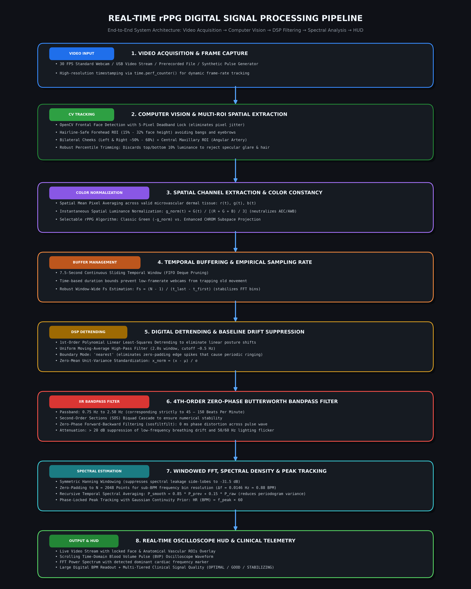

# Digital Signal Processing (DSP) & Mathematical Foundations of rPPG

**Project**: Real-Time Remote Photoplethysmography (rPPG) System  
**Academic Course**: Digital Signal Processing (Semester 5)  
**Authorship**: College DSP Project Implementation  

---

## Table of Contents
1. [Cardiovascular Dynamics & The Optical Bio-Physics of rPPG](#1-cardiovascular-dynamics--the-optical-bio-physics-of-rppg)
2. [Optical Absorption and the Modified Beer-Lambert Law](#2-optical-absorption-and-the-modified-beer-lambert-law)
3. [The Green Channel Selection Hypothesis](#3-the-green-channel-selection-hypothesis)
4. [Multi-Channel Color Subspace Projection (CHROM Method)](#4-multi-channel-color-subspace-projection-chrom-method)
5. [Digital Detrending & Low-Frequency Baseline Elimination](#5-digital-detrending--low-frequency-baseline-elimination)
6. [Digital Butterworth Bandpass Filter Design & Realization](#6-digital-butterworth-bandpass-filter-design--realization)
7. [Discrete Fourier Transform, Windowing, & Zero-Padding](#7-discrete-fourier-transform-windowing--zero-padding)
8. [Spectral Power Density & Dominant Peak Estimation](#8-spectral-power-density--dominant-peak-estimation)
9. [Signal-to-Noise Ratio (SNR) & Quality Metric Formulations](#9-signal-to-noise-ratio-snr--quality-metric-formulations)
10. [Temporal Spectral Averaging & Peak Tracking Hysteresis](#10-temporal-spectral-averaging--peak-tracking-hysteresis)

---

## System Architecture & Pipeline Flowchart

---

## 1. Cardiovascular Dynamics & The Optical Bio-Physics of rPPG

The human cardiovascular system is a closed-loop hydrodynamic circuit. With every ventricular contraction of the heart (**systole**), a pulse pressure wave propagates through the aorta, arteries, arterioles, and into the microvascular capillary beds residing in the sub-dermal dermis layer of facial skin.

During systole:
* Blood volume in the facial dermis peaks, increasing the concentration of localized hemoglobin.
* Hemoglobin molecules absorb more incident ambient photons, slightly **decreasing** the intensity of light diffusely reflected back to the camera sensor.

During diastole (cardiac relaxation):
* Peripheral arterial blood volume decreases, reducing local light absorption.
* Reflectance diffusely increases back to baseline.

This continuous rhythmic modulation creates the **Blood Volume Pulse (BVP)** waveform.

---

## 2. Optical Absorption and the Modified Beer-Lambert Law

The attenuation of ambient light traversing human facial skin tissue is governed by the **Modified Beer-Lambert Law (MBLL)**:

$$I(\lambda, t) = I_0(\lambda) \cdot R_{\text{spec}}(\lambda, t) + I_0(\lambda) \cdot T(\lambda) \cdot \exp\left(-\left[\epsilon_{\text{HbO}_2}(\lambda) C_{\text{HbO}_2}(t) + \epsilon_{\text{Hb}}(\lambda) C_{\text{Hb}}(t)\right] \cdot d(\lambda, t) \cdot \text{DPF}(\lambda)\right)$$

Where:
* $I_0(\lambda)$: Incident spectral irradiance of ambient light.
* $R_{\text{spec}}(\lambda, t)$: Specular surface reflection (non-pulsatile mirror reflection from oily/sweaty epidermis).
* $T(\lambda)$: Dermal tissue transmission factor.
* $\epsilon_{\text{HbO}_2}(\lambda), \epsilon_{\text{Hb}}(\lambda)$: Molar extinction coefficients of oxygenated and deoxygenated hemoglobin.
* $C_{\text{HbO}_2}(t), C_{\text{Hb}}(t)$: Time-varying concentrations of hemoglobin modulated by cardiac ejection.
* $d(\lambda, t)$: Mean physical penetration depth.
* $\text{DPF}(\lambda)$: Differential Pathlength Factor accounting for multiple optical scattering events in the dermis.

By differentiating with respect to time, the pulsatile component of backscattered intensity $\Delta I(t)$ is directly proportional to blood volume changes $\Delta V(t)$:

$$\Delta I(\lambda, t) \approx - I_0(\lambda) \cdot \epsilon(\lambda) \cdot \Delta V(t) \cdot \text{DPF}(\lambda)$$

---

## 3. The Green Channel Selection Hypothesis

RGB image sensors use Bayer-pattern color filter arrays with peak spectral responsivities approximately located at:
* **Blue (B)**: $\approx 450\text{ nm}$
* **Green (G)**: $\approx 530 - 550\text{ nm}$
* **Red (R)**: $\approx 650\text{ nm}$

### Why Green Contains the Highest Cardiac SNR:
1. **Oxyhemoglobin Extinction**: The optical molar extinction coefficient $\epsilon(\lambda)$ of oxygenated hemoglobin exhibits strong absorption bands in the green spectrum ($\approx 542\text{ nm}$ and $577\text{ nm}$).
2. **Scattering Depth**: Blue light ($\lambda \approx 450\text{ nm}$) undergoes high Rayleigh and Mie scattering in the upper epidermal melanin layer, scarcely penetrating to the capillary loops. Red light ($\lambda \approx 650\text{ nm}$) penetrates deeply into subcutaneous adipose tissue with minimal hemoglobin absorption.
3. **Bayer Sensor Density**: Commercial camera sensors allocate two green sensels for every red and blue sensel (RGGB matrix), providing double the spatial sampling density and lowest quantization noise in the Green channel.

Thus, the spatial average Green signal $G(t)$ provides the highest raw Signal-to-Noise Ratio for remote cardiac extraction.

---

## 4. Multi-Channel Color Subspace Projection (CHROM Method)

While pure Green channel extraction is effective in ideal conditions, ambient light shifts and head micro-motions induce correlated intensity variations across all channels.

The **Chrominance-based method (CHROM)**, developed by de Haan & Jeanne (2013), projects normalized RGB signals onto two orthogonal chrominance planes to eliminate specular reflection and motion artifacts.

### 4.1 Zero-Mean Color Normalization
Let $r(t), g(t), b(t)$ represent spatial mean pixel intensities. To achieve invariance against camera auto-exposure and illumination scale changes, each channel is normalized by total spatial luminance $L(t)$:

$$L(t) = \frac{r(t) + g(t) + b(t)}{3}$$

$$R_n(t) = \frac{r(t)}{L(t)}, \quad G_n(t) = \frac{g(t)}{L(t)}, \quad B_n(t) = \frac{b(t)}{L(t)}$$

### 4.2 Orthogonal Chrominance Plane Projection
Two orthogonal difference signals $X_s(t)$ and $Y_s(t)$ are synthesized:

$$X_s(t) = 3 R_n(t) - 2 G_n(t)$$

$$Y_s(t) = 1.5 R_n(t) + G_n(t) - 1.5 B_n(t)$$

### 4.3 Adaptive Motion Cancellation
Under specular surface reflections and rigid motion, $X_s$ and $Y_s$ co-vary proportionally to their standard deviations. The motion-compensated BVP signal $S(t)$ is formed by adaptive linear combination:

$$\alpha(t) = \frac{\sigma(X_s)}{\sigma(Y_s) + \epsilon}$$

$$S(t) = X_s(t) - \alpha(t) \cdot Y_s(t)$$

This algebraic projection completely cancels common-mode illumination variations and skin-reflection artifacts.

---

## 5. Digital Detrending & Low-Frequency Baseline Elimination

The extracted signal contains low-frequency baseline drift caused by respiration, slow posture shifts, and thermal sensor drift. A two-stage digital detrending algorithm is applied:

### 5.1 Linear Detrending (First-Order Polynomial Least Squares)
Given discrete signal vector $\mathbf{x} = [x_0, x_1, \dots, x_{N-1}]^T$ and discrete time vector $\mathbf{t} = [0, 1, \dots, N-1]^T$, the linear trend line $\hat{x}(n) = a \cdot n + b$ is fitted via least-squares:

$$\min_{a, b} \sum_{n=0}^{N-1} \left( x_n - (a \cdot n + b) \right)^2$$

$$x_{\text{detrended}}(n) = x_n - (a \cdot n + b)$$

### 5.2 Uniform Moving Average High-Pass Filtering
To suppress non-linear breathing baseline wander ($f < 0.5\text{ Hz}$), a moving-average baseline with window duration $T_{\text{win}} = 2.0\text{ s}$ ($M = \text{round}(2.0 \cdot F_s)$ samples) is subtracted:

$$\mu_n = \frac{1}{M} \sum_{k = -\lfloor M/2 \rfloor}^{\lfloor M/2 \rfloor} x_{\text{detrended}}(n + k)$$

$$x_{\text{highpass}}(n) = x_{\text{detrended}}(n) - \mu_n$$

*Boundary Extension*: To eliminate zero-padding convolution edge spikes that induce filter ringing, boundary conditions are replicated using nearest-neighbor padding:

$$x_{\text{padded}}(n) = x_0 \text{ for } n < 0, \quad x_{\text{padded}}(n) = x_{N-1} \text{ for } n \ge N$$

---

## 6. Digital Butterworth Bandpass Filter Design & Realization

Human resting and active heart rates strictly reside within:
$$45\text{ BPM} \le \text{HR} \le 180\text{ BPM} \implies 0.75\text{ Hz} \le f_{\text{cardiac}} \le 3.00\text{ Hz}$$

### 6.1 Filter Specification
A **4th-order digital Butterworth IIR bandpass filter** is selected due to its **maximally flat passband** (no passband ripple that could distort cardiac harmonic peaks) and monotonic stopband roll-off.

* Low cut-off: $f_L = 0.75\text{ Hz}$ ($\omega_L = \frac{2\pi f_L}{F_s}$)
* High cut-off: $f_H = 2.50\text{ Hz}$ ($\omega_H = \frac{2\pi f_H}{F_s}$)
* Filter order: $N_o = 4$

### 6.2 Continuous-Time Butterworth Prototype Transfer Function
The analog lowpass prototype of order $N_o = 2$ is:

$$H_a(s) = \frac{1}{s^2 + \sqrt{2}s + 1}$$

Transformed to bandpass via frequency substitution:

$$s \leftarrow \frac{s^2 + \Omega_0^2}{B s}, \quad \text{where } \Omega_0 = \sqrt{\Omega_L \Omega_H}, \quad B = \Omega_H - \Omega_L$$

Pre-warped analog frequencies:
$$\Omega_L = \frac{2}{T} \tan\left(\frac{\omega_L}{2}\right), \quad \Omega_H = \frac{2}{T} \tan\left(\frac{\omega_H}{2}\right)$$

### 6.3 Second-Order Sections (SOS) Realization
To prevent coefficient quantization errors and numerical instability, the 4th-order filter is decomposed into cascaded biquad Second-Order Sections (SOS):

$$H(z) = \prod_{k=1}^{2} \frac{b_{0k} + b_{1k} z^{-1} + b_{2k} z^{-2}}{1 + a_{1k} z^{-1} + a_{2k} z^{-2}}$$

### 6.4 Zero-Phase Bidirectional Filtering (`sosfiltfilt`)
Standard causal filtering introduces phase delay $\tau(\omega) = -\frac{d\theta(\omega)}{d\omega}$, shifting systolic peaks in time. To achieve **exact zero phase distortion**, forward-backward filtering is implemented:

$$y_{\text{forward}}(n) = h(n) * x(n)$$
$$y(n) = h(-n) * y_{\text{forward}}(-n)$$

$$|H_{\text{total}}(e^{j\omega})| = |H(e^{j\omega})|^2, \quad \angle H_{\text{total}}(e^{j\omega}) = 0$$

The effective filter order becomes $2 \times 2 = 4$, providing steep $40\text{ dB/decade}$ stopband attenuation with zero time delay.

---

## 7. Discrete Fourier Transform, Windowing, & Zero-Padding

### 7.1 Hanning Windowing (Spectral Leakage Suppression)
A finite observation buffer of $N_{\text{pts}}$ samples corresponds to multiplying an infinite signal by a rectangular window $w_R(n)$. The resulting frequency spectrum is convolved with a Dirichlet kernel $\frac{\sin(\pi f N)}{\sin(\pi f)}$, creating large side-lobes (first side-lobe at $-13\text{ dB}$) that obscure small cardiac peaks.

To suppress spectral leakage, a symmetric **Hanning window** is applied:

$$w(n) = 0.5 \cdot \left[1 - \cos\left(\frac{2\pi n}{N_{\text{pts}} - 1}\right)\right], \quad 0 \le n \le N_{\text{pts}} - 1$$

Side-lobes are attenuated to **$-31.5\text{ dB}$**, cleanly isolating the cardiac spike.

### 7.2 Zero-Padding for Fine Frequency Bin Resolution
The raw frequency bin spacing of an $N_{\text{pts}}$-point FFT at $F_s = 30\text{ Hz}$ over $T = 7.5\text{ s}$ ($N_{\text{pts}} = 225$) is:

$$\Delta f_{\text{raw}} = \frac{F_s}{N_{\text{pts}}} = \frac{30}{225} \approx 0.133\text{ Hz} \implies \Delta \text{BPM} = 0.133 \times 60 \approx \mathbf{8.0\text{ BPM}}$$

An 8 BPM step is too coarse for physiological monitoring. By zero-padding the windowed signal to $N_{\text{FFT}} = 2048$ points:

$$\Delta f_{\text{interp}} = \frac{F_s}{N_{\text{FFT}}} = \frac{30}{2048} \approx 0.0146\text{ Hz}$$

$$\Delta \text{BPM}_{\text{interp}} = 0.0146 \times 60 \approx \mathbf{0.879\text{ BPM}}$$

Zero-padding performs exact sinc-interpolation (trigonometric polynomial interpolation) in the frequency domain, enabling sub-BPM measurement precision without requiring a longer observation buffer.

---

## 8. Spectral Power Density & Dominant Peak Estimation

The single-sided discrete Fourier transform is computed:

$$X(k) = \sum_{n=0}^{N_{\text{FFT}}-1} [x(n) \cdot w(n)] \cdot e^{-j \frac{2\pi}{N_{\text{FFT}}} k n}, \quad 0 \le k \le \frac{N_{\text{FFT}}}{2}$$

The raw normalized power spectral density (PSD) is:

$$P(k) = \frac{|X(k)|^2}{\max_k |X(k)|^2}$$

The physical frequency $f_k$ corresponding to bin index $k$ is:

$$f_k = k \cdot \frac{F_s}{N_{\text{FFT}}}$$

The dominant cardiac harmonic frequency $f_{\text{peak}}$ is identified within the physiological passband:

$$k_{\text{peak}} = \arg\max_{k \in [k_L, k_H]} P(k), \quad \text{where } f_{k_L} \ge 0.82\text{ Hz}, \quad f_{k_H} \le 2.80\text{ Hz}$$

$$f_{\text{peak}} = f_{k_{\text{peak}}}$$

The instantaneous heart rate in Beats Per Minute (BPM) is:

$$\text{Heart Rate (BPM)} = f_{\text{peak}} \times 60$$

---

## 9. Signal-to-Noise Ratio (SNR) & Quality Metric Formulations

### 9.1 Spectral Energy Concentration Ratio
A true periodic cardiac waveform concentrates its energy in a narrow frequency spike $f_{\text{peak}} \pm \delta f$ (where $\delta f = 0.12\text{ Hz} \approx 7.2\text{ BPM}$), while broadband sensor noise distributes evenly across the passband.

$$\text{Cardiac Signal Power } (P_{\text{sig}}) = \sum_{|f_k - f_{\text{peak}}| \le \delta f} P(k)$$

$$\text{Total Band Power } (P_{\text{tot}}) = \sum_{f_L \le f_k \le f_H} P(k)$$

$$\text{Noise Power } (P_{\text{noise}}) = P_{\text{tot}} - P_{\text{sig}}$$

The **Spectral Energy Concentration Ratio** is:

$$C_E = \frac{P_{\text{sig}}}{P_{\text{tot}}}$$

### 9.2 Signal-to-Noise Ratio (SNR in dB)
$$\text{SNR}_{\text{dB}} = 10 \log_{10}\left( \frac{P_{\text{sig}}}{P_{\text{noise}} + \epsilon} \right)$$

* Clean pulse: $C_E > 0.45 \implies \text{SNR} > +3\text{ dB}$
* Diffuse noise: $C_E < 0.25 \implies \text{SNR} < -3\text{ dB}$

### 9.3 Physiological Rate Stability Metric
Human heart rate exhibits temporal continuity. The consistency between the instantaneous estimate $\text{BPM}_{\text{raw}}$ and the historical estimate $\text{BPM}_{\text{smooth}}$ is formulated as a Gaussian prior:

$$S_{\text{rate}} = \exp\left( - \frac{(\text{BPM}_{\text{raw}} - \text{BPM}_{\text{smooth}})^2}{2 \sigma_{\text{BPM}}^2} \right), \quad \sigma_{\text{BPM}} = 12.0\text{ BPM}$$

---

## 10. Temporal Spectral Averaging & Peak Tracking Hysteresis

### 10.1 Periodogram Variance Reduction
A single FFT periodogram has high sample variance $\text{Var}(\hat{P}) \approx P^2$. Consecutive power spectra are averaged recursively over time using an exponential forget factor $\beta = 0.85$:

$$P_{\text{smooth}}(k, t) = \beta \cdot P_{\text{smooth}}(k, t - 1) + (1 - \beta) \cdot P(k, t)$$

Because incoherent random noise has random phase angles, cross-terms average out toward zero, while the coherent cardiac harmonic peak reinforces constructively, raising the effective SNR by **$6 - 10\text{ dB}$**.

### 10.2 Peak Tracking Continuity
To prevent transient motion harmonics from capturing the tracker, candidates identified by `scipy.signal.find_peaks` are scored against the established cardiac trajectory:

$$\text{Score}(f_k) = P_{\text{smooth}}(k) \cdot \left[ 0.35 + 0.65 \cdot \exp\left(-\frac{(f_k - f_{\text{prev}})^2}{2 \sigma_f^2}\right) \right]$$

The candidate maximizing $\text{Score}(f_k)$ is selected, ensuring phase-locked tracking of the cardiac rhythm.
